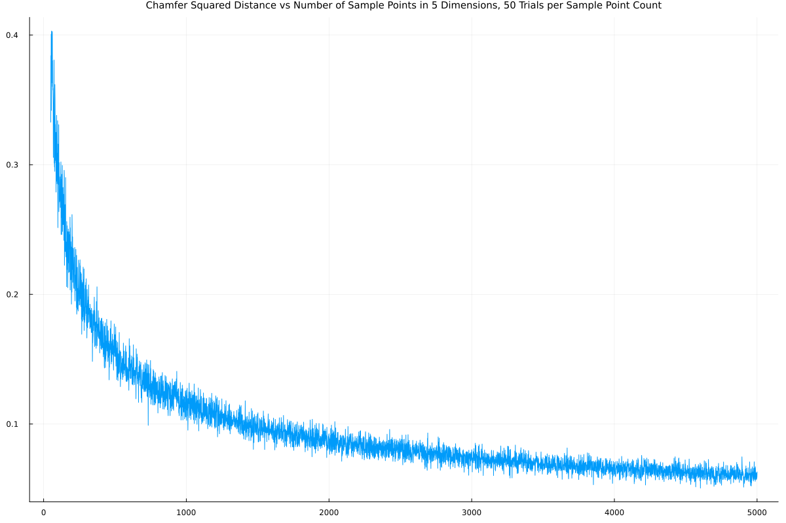
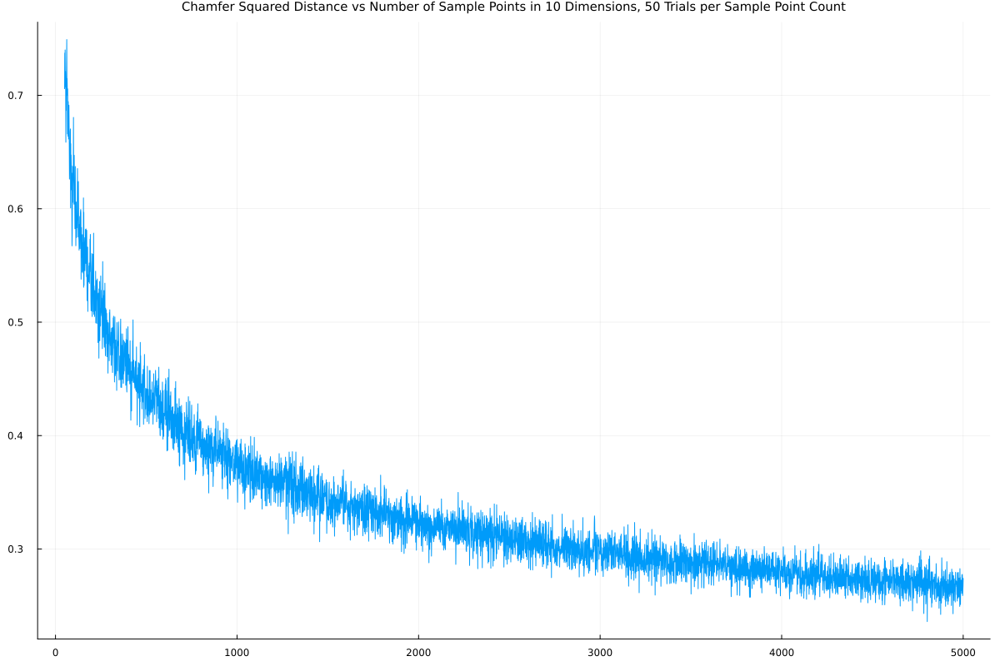
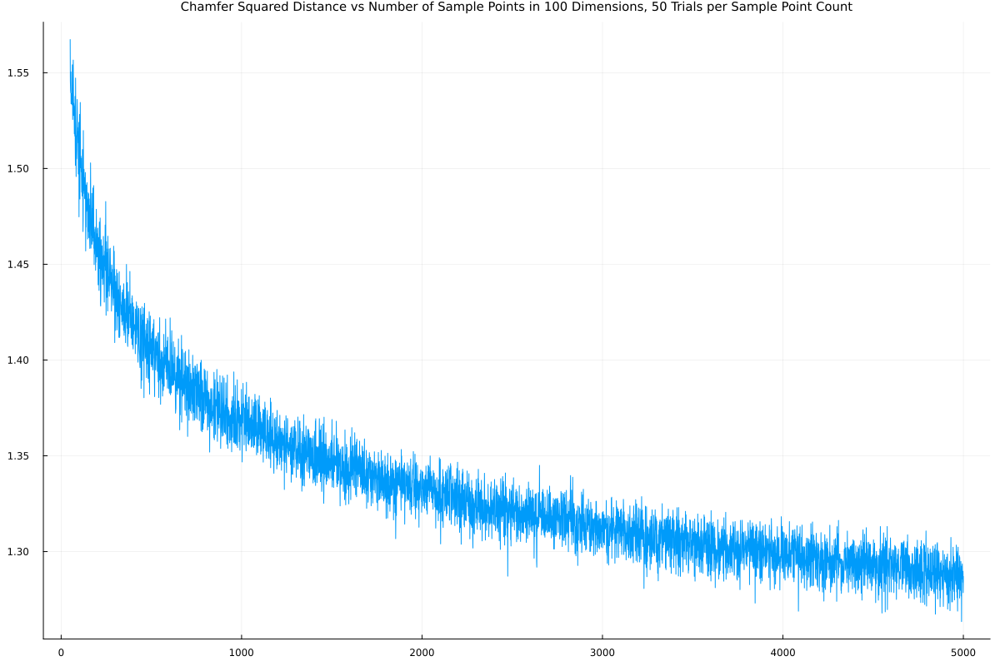
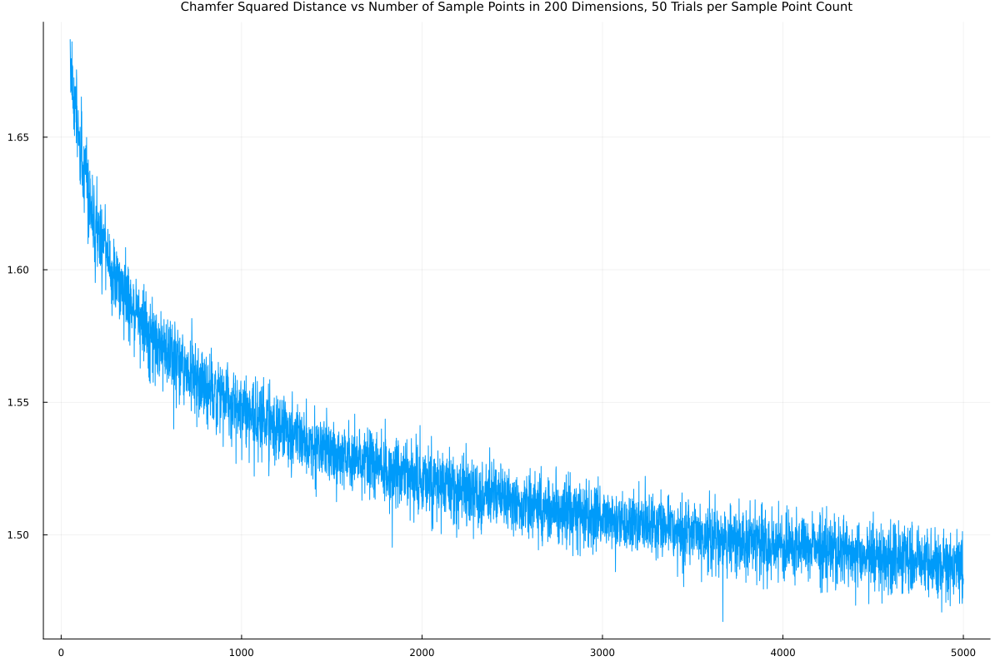

#  Chamfer Distance Convergence Simulations
## Problem Description
The Chamfer distance is a pseudometric (it's not symmetric) used to measure the distance between two clusters of data, sometimes used in the context of computer vision. Specifically, let $D_1:=\{x_i\}$ and $D_2:=\{y_j\}$ be our two finite data sets contained in $\mathbb{R}^d$ for some $d\in \mathbb{N}$. The (unidirectional) Chamfer distance is defined as:

$d_C(D_1,D_2):=\left[\frac{1}{|D_1|}\sum_{x_i\in D_1}\min_{y_j\in D_2} \|x_i-y_j\|^2  \right]^{1/2}$

This simple project was designed to approximate the convergence rate of the Chamfer distance as the number of sample points in $D_2$ grows large in various dimensions. This is done by simulating points sampled uniformly on the surface of a hypersphere, representing a fairly worst-case scenario for a distribution on any given compact set.

Note that this can be determined exactly through use of order statistics for normal distributions, but those calculations have no closed form and are numerically unstable. Hence the usage of monte carlo simulations.

## Methods

Normally one generates points on the surface of a sphere using multivariate gaussian distributions, but that proves to be computationally expensive in higher dimensions (generating a single point in $\mathbb{R}^d$ requires $d$ IID normal samplings, which explodes the computational cost for large simulation runs). Instead, by spherical symmetry, we assume that the first point drawn is $x_i=(1,0,\dots,0)$. For the second point, we don't need to sample every component, since we can express the distance as

$\|x_i-y_j\|^2= (1-y_{j,1})^2+\|y_j'\|^2$

where $y_j'$ agrees with $y_j$ in all components except the first, which is set to $0$. Then, since $\|y'_j\|^2 = \sum_{k>1}y_{j,k}^2$ corresponds to the sum of the squares of $j-1$ IID normals, this is exactly the same as sampling from a Chi-Squared distribution. Thus, with $X\sim\chi^2$ corresponding to a chi-squared distribution with $j-1$ degrees of freedom and $N\sim\mathcal{N}(0,1)$ a normal distribution, we can equivalently simulate:

$r= \frac{1}{(N^2+X)^{1/2}}$

$\|x_i-y_j\|^2= (1-\frac{N}{r})^2 + \frac{X}{r^2}$

Which is vastly more efficient computationally. By linearity of the squared Chamfer distance, we need only compute the distance to a single point. Letting $(N_j, X_j)_j$ represent $|D_2|$ IID draws from  $(N, X)$, we have:

$d_C(D_1,D_2)^2=\frac{1}{|D_1|}\sum_{x_i\in D_1}\min_{y_j\in D_2} \|x_i-y_j\|^2$

$= \min_{y_j\in D_2} \|x_1-y_j\|^2$

$= \min_j\left(1-\frac{N_j}{r}\right)^2 + \frac{X_j}{r^2}$

Thus, if we have $n$  data points in $D_2$, we take $n$ draws from $(1-\frac{N}{r})^2 + \frac{X}{r^2}$ and take the minimum value. For each value of $n$ this is repeated 50 times, and we plot the results.

## Results

5 Dimensions:

10 Dimensions:

100 Dimensions:

200 Dimensions:

The fuzziness is due to noise in the simulation; even with the improved chi-squared method, each simulation run is fairly expensive, so only 50 trials are performed at each sample point count. Even still, the overall shape is clearly visible, and there are no surprises here. Convergence becomes increasingly slow as the dimension increases, which is precisely what we should expect given CoD. 